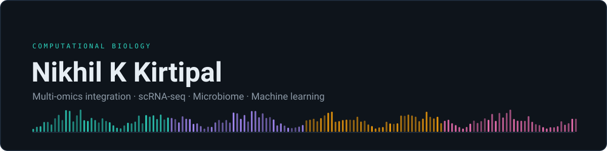

<div align="center">



<br>


<a href="https://scholar.google.com/citations?user=m86BQsIAAAAJ&hl=en">

</a>
&nbsp;
<a href="https://www.linkedin.com/in/dr-nikhilkkirtipal">

</a>
&nbsp;
<a href="https://orcid.org/0000-0001-7422-3408">

</a>
&nbsp;
<a href="https://www.researchgate.net/profile/Nikhil-K-Kirtipal">

</a>

</div>

---

## 🔬 Current Research

My work focuses on using computational biology, multi-omics and machine learning to investigate biological mechanisms underlying human disease.

### Current areas

- 🫁 **Respiratory disease and COPD**
- 🧬 **Respiratory microbiome**
- 🔬 **Single-cell transcriptomics**
- 🧪 **Multi-omics integration**
- 🤖 **Machine learning for biological prediction**
- 🧠 **Interpretable AI and biological discovery**
- 🧫 **Disease and cancer genomics**

---

## 💻 Computational Toolkit

| Area | Methods & Tools |
|:---|:---|
| **Programming** | R · Python · Bash |
| **Single-cell** | Seurat · Scanpy · SingleR · CellChat · SCENIC · Monocle |
| **Bulk RNA-seq** | DESeq2 · WGCNA |
| **Microbiome** | DADA2 · phyloseq · MMUPHin · MaAsLin2 |
| **Metagenomics** | MetaPhlAn · HUMAnN · bioBakery |
| **Machine Learning** | Random Forest · XGBoost · SHAP |
| **Deep Learning** | PyTorch · CNN |
| **Dimensionality Reduction** | PCA · PCoA · UMAP |
| **Statistics** | PERMANOVA · differential abundance · survival analysis |
| **Workflow / HPC** | Snakemake · SLURM |
| **Cancer Genomics** | TCGA · GTEx · Xena · MAF |
| **Visualization** | ggplot2 · ComplexHeatmap · Cytoscape |

---

## 🧪 Computational Biology Workflow

<div align="center">
<table>
<tr><td align="left">
<pre>
```text
Biological Question
        │
        ▼
   Data Generation
        │
        ▼
 ┌─────────────────────┐
 │ Multi-Omics Data    │
 │                     │
 │ RNA-seq             │
 │ scRNA-seq           │
 │ Microbiome          │
 │ Metagenomics        │
 └─────────────────────┘
        │
        ▼
 Data Processing & QC
        │
        ▼
 Statistical Analysis
        │
        ▼
 ┌─────────────────────┐
 │ Computational       │
 │ Modeling            │
 │                     │
 │ ML · Network        │
 │ Regulatory Biology  │
 └─────────────────────┘
        │
        ▼
 Biological Interpretation
        │
        ▼
      Insight
</pre>
</td></tr>
</table>
</div>
```

---

## 🧬 Background

Wet-lab 🧪 biologist turned computational researcher — driven by biological questions, building tools and pipelines whenever the biology demands it.

---

<div align="center">

### 🧬 Always learning — from 🧪 pipettes to 🐍 pipelines!

</div>
